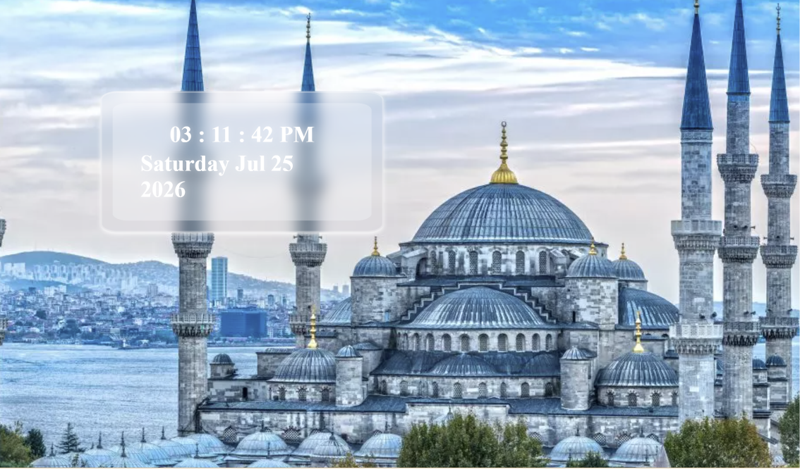

# Digital Clock

A real-time digital clock built with HTML, CSS, and JavaScript.

## 📸 Preview

<!-- Add a screenshot of the clock running to the repo and update the filename above -->

## ✨ Features

- Live time display updating every second
- Shows day, date, month, and year
- Background: Hagia Sophia, Istanbul — a personal tribute to the Ottoman Empire and Sultan Muhammad Al-Fateh, who conquered Constantinople at just 21 years old

## 🛡️ Why This Background

I admire Sultan Muhammad Al-Fateh deeply — a leader who achieved something historic at an age when most people are still figuring out their path. His discipline and vision are a constant source of inspiration for me, especially as I build my own skills one project at a time. Every time this clock updates, it sits in front of a reminder: age and background are never limits, only starting points.

## 🛠️ Tech Stack

HTML | CSS | JavaScript

## 📌 What I Learned

- Working with the JavaScript `Date` object
- Using `setInterval()` for real-time updates
- DOM manipulation to display live data

## 🔗 More Projects

Check out my other work: [github.com/nawaz76158-maker](https://github.com/nawaz76158-maker)

## 👤 Built By

Mohammad Nawaz — BCA Student, Ballari, Karnataka

---
*Built as part of my JavaScript practice.*